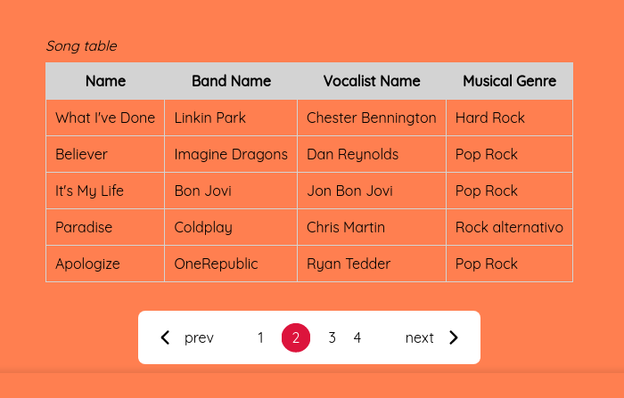

<h1 align="center"> Pagination of Musics </h1>

  Projeto com intuito de treinar ainda mais a minha lógica com Javascript, desta vez com um componente que está presente em muitos sites atualmente, a paginação de dados.

  <a href="#tecnologies">Tecnologias</a>&nbsp;&nbsp;&nbsp;|&nbsp;&nbsp;&nbsp;
  <a href="#project">Projeto</a>&nbsp;&nbsp;&nbsp;|&nbsp;&nbsp;&nbsp;
    <a href="#orientations">Orientações</a>&nbsp;&nbsp;&nbsp;|&nbsp;&nbsp;&nbsp;
  <a href="#challenges">Desafios</a>&nbsp;&nbsp;&nbsp;|&nbsp;&nbsp;&nbsp;
  <a href="#extres">Extras</a>&nbsp;&nbsp;&nbsp;|&nbsp;&nbsp;&nbsp;
  <a href="#license">Licença</a>

  

 

  

## 🚀 Tecnologias

 Esse projeto foi desenvolvido com as seguintes tecnologias: 

- HTML, CSS, JavaScript.

## 💻 Projeto

  O projeto é bem simples de entender, há uma tabela com algumas músicas regastadas lá do back-end (PHP) através de uma API e uma paginação para exibir apenas algumas músicas, com liberdade para o usuário poder trocar de página. O Desafio era simplesmente desenvolver uma simples paginação com JS puro e dados vindo de uma API criada propriamente por mim.  

## 🗺️ Orientações

 Para rodar a aplicação é bem simples, siga os passos:

* Baixar a [API](https://github.com/Erisvaldo15/api_php) em sua máquina;
* Dentro de sua pasta (API) rodar o comando 'php -S localhost:9000 -t public' pelo terminal.
* Instalar as dependências da API com o composer.
* Ter este projeto em sua máquina e depois é só rodar. Dica: é possível rodá-lo com o live server, por exemplo.

## ⚔️ Desafios enfrentados

  O principal desafio de longe foi racionar, pensar em como eu poderia realizar a paginação. 

## 🧑‍🔧 Extras

 
  Algumas Melhorias que devem ser feitas por eu ou até mesmo por você caso queira no futuro:

  <ul style="margin-left: 20px">
      <li> Fique a vontade para fazer o que quiser. </li>
  </ul>

<ul style="margin-left: 20px" id="orientations">
    
</ul>

## :memo: Licença

 Esse projeto está sob a licença MIT. 
